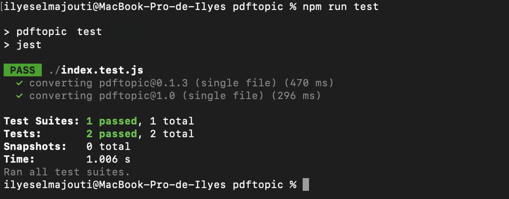
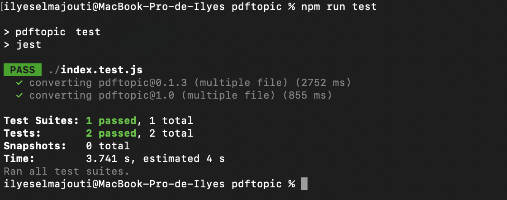
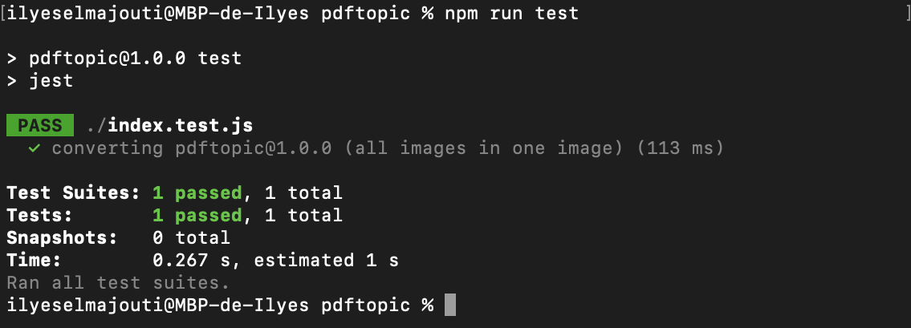

## **PDFTOPIC *By Ilyes-El-Majouti***
<center>


[](https://www.codefactor.io/repository/github/ilyes-el-majouti/pdftopic)

[](https://www.paypal.me/IlyesElMajouti)


[](https://github.com/Ilyes-El-Majouti/pdftopic)

</center>

The `pdftopic` package offers an advanced solution for converting PDF files into various image formats such as PNG, JPG, etc. With a particular focus on rendering quality, `pdftopic` distinguishes itself by producing output of exceptional quality, surpassing the performance of other packages available on the market. Designed to meet the critical needs of demanding users, `pdftopic` effectively and reliably solves the rendering quality problems that many other packages present, offering an unrivalled and reliable PDF conversion solution for developers and IT professionals.

> IMPORTANT NOTE: We strongly encourage you to support this library by making a donation via [PayPal](https://www.paypal.me/IlyesElMajouti). Your generosity is highly appreciated, and we also welcome contributors with gratitude!

### **Prerequisites**

* node >= 12.x 
* imagemagick

### Don't have imagemagick yet ?

Follow [this](docs/dependencies-installation.md) guide to install the required dependencies.

## Installation
 s
```bash
npm install --save pdftopic
```

## Usage

### Converting specific page of PDF from buffer, then saving as image file

```javascript
import pdftopic from "pdftopic";
import fs from "fs";

(async () => {
  const curriculum_vitae = fs.readFileSync('./pdf_files/curriculum_vitae.pdf');

  const converted_result = await pdftopic.pdftobuffer(curriculum_vitae, 0);
  fs.writeFileSync(`./png_files/curriculum_vitae.png`, converted_result[0]);
})();
```

### Converting specific pages of PDF from buffer, then saving as image file

```javascript
import pdftopic from "pdftopic";
import fs from "fs";

(async () => {
  const curriculum_vitae = fs.readFileSync('./pdf_files/curriculum_vitae.pdf');

  const converted_result = await pdftopic.pdftobuffer(curriculum_vitae, [ 1, 3 ]);
  converted_result.forEach((file, index) => {
    fs.writeFileSync(`./curriculum_vitae-${index}.png`, file);
  });
})();
```

### Converting all pages of PDF from buffer, then saving as image file

```javascript
import pdftopic from "pdftopic";
import fs from "fs";

(async () => {
  const curriculum_vitae = fs.readFileSync('./pdf_files/curriculum_vitae.pdf');

  const converted_result = await pdftopic.pdftobuffer(curriculum_vitae, "all");
  
  converted_result.forEach((file, index) => {
      fs.writeFileSync(`./png_files/curriculum_vitae-${index}.png`, file);
  });
})();
```

### Converting all pages of PDF from buffer, then concat images and save image file

```javascript
import pdftopic from "pdftopic";
import fs from "fs";

(async () => {
  const curriculum_vitae = fs.readFileSync('./pdf_files/curriculum_vitae.pdf');

  const converted_result = await pdftopic.pdftobuffer(curriculum_vitae, "all");
  const concat_converted_result = await pdftopic.bufferstoappend(allfiles);

  fs.writeFileSync(`./png_files/curriculum_vitae-big.png`, concat_converted_result);
})();
```

## PDFTOPIC API

- [pdftobuffer(buffer, page, progress)](#pdftobufferbuffer-page-progress)
- [bufferstoappend(buffers, progress)](#bufferstoappendbuffers-progress)
- [pdftocount(buffer)](#pdftocountbuffer)
- [getDimmentions(buffers)](#getdimmentionsbuffers)

### pdftobuffer(buffer, page, progress)

Initiate the conversion of a PDF to a buffer by supplying the function with a PDF and a specific page number or 'all' for the entire document. The function validates the input and processes the conversion accordingly, with an optional progress bar to track the process.

#### Functions

Convert a specific page of the PDF to Image/Buffer by supplying a file path.

```javascript
pdftobuffer(buffer, page, progress)
```
* buffer - buffer pdf file
* page - page number to convert to an image
* progress - progress converting.

---

Converts PDF to Image/Buffer by supplying a file path
```javascript
pdftobuffer(buffer, pages, progress)
```
* buffer - buffer pdf file
* pages - page numbers to convert to image
  * set `pages` to `"all"` to convert all pages
  * `pages` also accepts an array indicating the page number e.g. `[1,2,3]`
  * also accepts number e.g. `1`
* progress - progress converting
  * set `false` to disable progressbar (in default)
  * set `true` to enable progressbar

---
### bufferstoappend(buffers, progress)

Kick-start the concatenation of multiple buffers by feeding the function with an array of buffers.

#### Functions

Concatenate multiple buffers into a single buffer by providing an array of buffers to the function. The function processes each buffer, appends them together, and returns the combined buffer.

```javascript
bufferstoappend(buffers, progress)
```
* buffers - array of buffers images
---

### pdftocount(buffer)

Start the process of counting the number of pages in a PDF by providing a PDF buffer to the function.

#### Functions

Determine the total number of pages in a PDF document by supplying the PDF to the function. The function loads the PDF and returns the page count.

```javascript
pdftocount(buffer)
```
* buffer - buffer pdf file

---

### getDimmentions(buffers)

To use the `getDimmentions` function, you need to provide an array of buffers as input. Each element of this array must represent an image in buffer form. Make sure that each buffer in the array corresponds to a valid image. Once you've supplied this array of buffers, you can use it as an argument to call the `getDimmentions` function.

#### Functions

The `getDimmentions` function is an asynchronous function that takes an array of buffers as an argument. The function returns an object containing the following information:

- outputImgWidth: the maximum width of all the images in the array.
- outputImgHeight: the sum total of the heights of all the images in the array.
- dimmentions: an array containing the dimensions (width and height) of each image in {width, height} format.
- channels: the number of elements in the dimensions array, corresponding to the number of images processed.

```javascript
getDimmentions(buffers)
```
* buffers - array of buffers images


## New updates

### `[ADDITION]` TypeScript Support Added

In line with the latest update, version `pdftopic@1.0.2-alpha` now includes TypeScript support. This addition enables developers to harness the benefits of TypeScript within their projects, enhancing code quality, readability, and maintainability. With TypeScript support, users can leverage static typing, improved code intelligence, and a more robust development experience.

### `[UPDATE]` Simple file conversion


As part of this update, a comparative evaluation of conversion speed was carried out on a single file between version `pdftopic@0.1.3` and the latest version `pdftopic@1.0.0`. This analysis revealed a significant improvement in conversion performance in the latest version, demonstrating a clear acceleration in the conversion process.

### `[UPDATE]` Multiple file conversion


In line with this update, a comparative analysis of conversion speed was carried out between the previous version `pdftopic@0.1.3` and the current version `pdftopic@1.0.0`, based on the processing of several files. This evaluation demonstrated a significant improvement in conversion performance in the more recent version, highlighting a clear acceleration in the conversion process.

### `[ADDITION]` Concatenate multiple images into a single visual entity


In line with this update, the current version of `pdftopic@1.0.0` has been enhanced by the integration of an image merge feature, enabling multiple images to be combined into a single visual entity. Although this feature is still in the beta phase, we are currently working on an improved beta version, offering even faster merging speeds than those currently available.